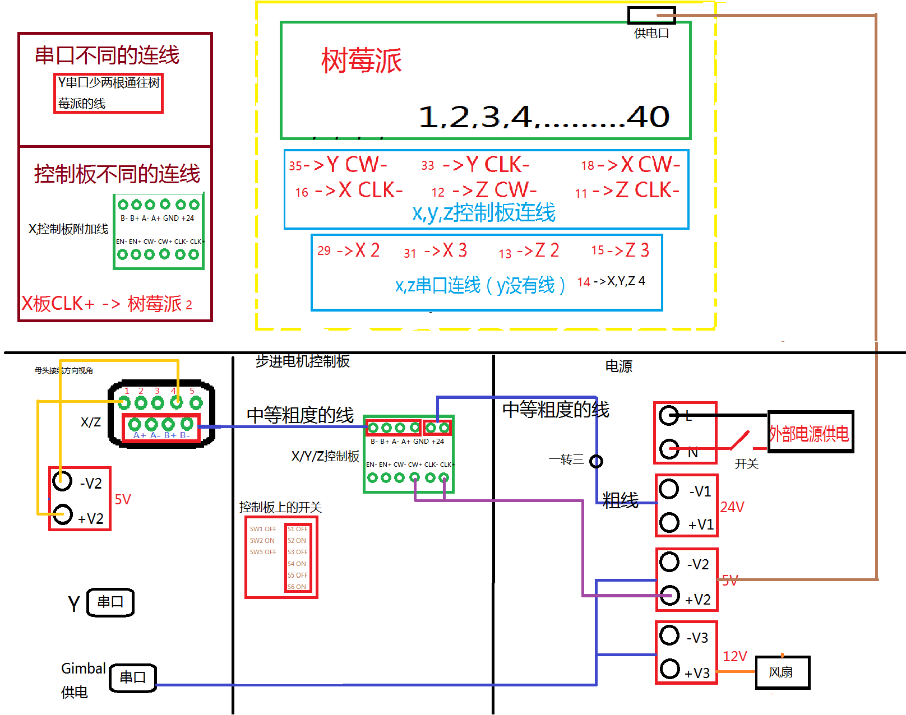
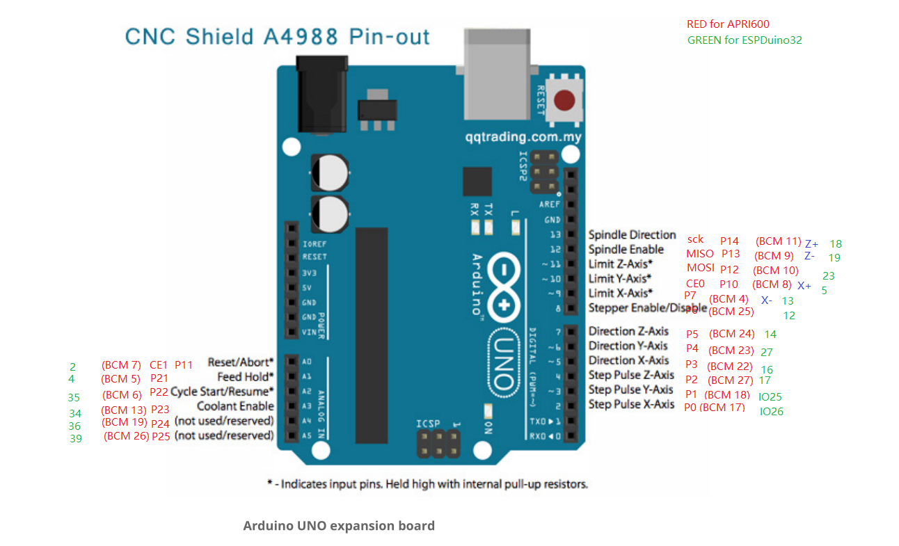
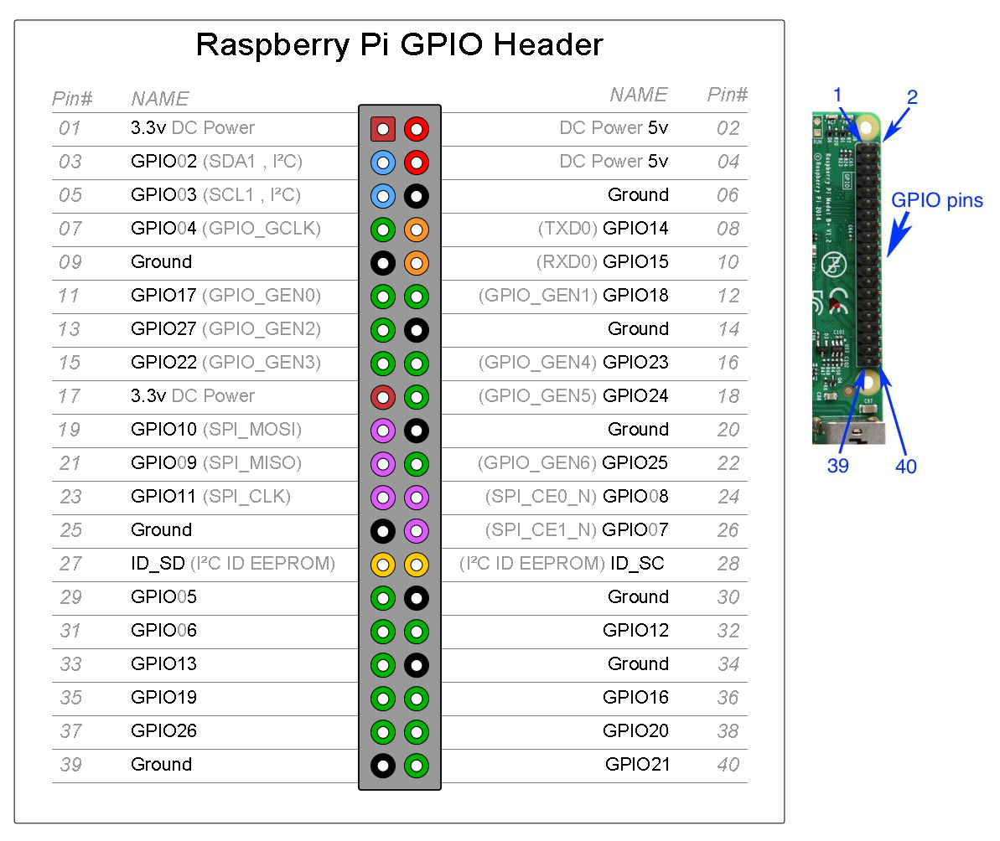

# 六自由度平台组装教程

## Gimbal 旋转台

### 材料

* Raspberry Pi x 1
* DC motor x 3
* DC 12V->5V x 1
* MPU6050 x 1
* And wires

### 步骤

参照之前连线方式进行连接的就好

## Platform 平移台控制箱

### 材料

* Raspberry Pi x 1
* DC 12V->5V x 1
* 9 针串口 x 3
* 串口对应连线 -- (步进电机线x4) x 3 + (霍尔限位线x4) x2 [Y 轴无限位]
* ARPI600扩展板 - Raspberry Pi Arduino适配板 x 1
* DRV8825 步进电机控制模块 x 4 (1 备用)
* 小开关
* 小风扇
* 线材：开关与电源接口线，DC 降压模块对应线，风扇对应线，扩展板连线
* 面包板（支撑 Rasp 用）
* 铜柱/螺丝：Rasp 与扩展板，Rasp 与面包板
* 控制箱外壳

### 步骤

* Rasp 拷贝之前做好的系统，尝试 putty 进入无误
* DRV8825 调整电压至 0.5V（对应 1.0A，可将其接到红色 5 轴驱动板进行调整），参见 [RAMP14.md](../ramps/RAMP14.md)
* DRV8825 安装到扩展板上
* Rasp 与扩展板铜柱稳定固定
* 串口线焊接，串口线（步进电机控制线）连接扩展板上 DRV8825，接线方式参照下图（左下角），Y 轴无需霍尔原件对应连线

* 按照下面各图连接串口线（霍尔元件线）与扩展板

NOTE:
如果使用的是 ，需要参见:[RASPBERRY PI Arduino Shield ADD-ON](https://www.itead.cc/wiki/RASPBERRY_PI_Arduino_Shield_ADD-ON) 来连线，即下图：

 右侧橘色框。

**此时可以进行连线测试**，注：此时可以考虑直接 Rasp 5V 电源供电，扩展板使用 12V 电源供电，暂时无需使用 DC 转换模块。

此步是验证上诉各项无误，测试顺序如下： 
1. 连通 Rasp 后，运行 [https://github.com/MiaoDX/platformMovingV2/blob/master/platformMovingTest.cpp](https://github.com/MiaoDX/platformMovingV2/blob/master/platformMovingTest.cpp) 程序（输入 0，测试正方向），观察并记录 X/Z 运动正方向（此方向与连线方式相关，仅记录即可） 
2. 开启 Rasp WebIO（参见 [../raspberryPi/README.md](../raspberryPi/README.md)），旋转 X/Z 至**正方向**限位状态，观察是否与上述连线设置（ARPI600扩展板）一致，即按照目前正方向移植限位会导致预计正方向限位 IO 口数值变化（由低到高）。如若不然，可以考虑更换步进电机控制线，由 1234 换为 2134 或 1243，亦可以考虑将限位线进行替换。
3. 运行测试程序（输入 1，测试归位操作）

* 切割面包板至合适大小
* Rasp 与面包板固定
* 连接电源接口，开关，DC 转换模块，风扇

**此时进行装机前测试**，此时使用统一供电，树莓派进行 5V 端口供电，可尝试测试归位操作。

* 装机

** 装机后测试 **
