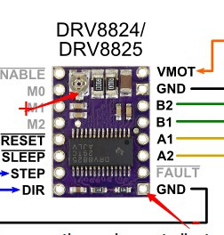
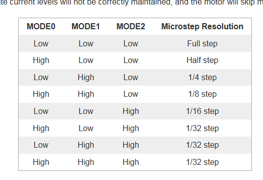

Some information about RAMP1.4 & DRV 8825

## Prepare before using

Change the electric current limit to less than 2.5A, and the electric current should depend on the stepper controller board, and, for many boards, it's okay to set it to 1.0A.

[DRV8825 和 MKS DRV8825 使用问题](https://tieba.baidu.com/p/3643680659)

>DRV8825 由于wiki的设计问题，默认Vref大约1.6v，默认电流已经3.2A，不调节会很热非常容易烧毁！

>驱动电流算法：i = vref x 2，电位器有三个引脚，用万用表测试面向8825方向的引脚的电压为Vref，如下图所示：

>可通过电位器调节电流，顺时针拧是增大电流，逆时针是减小电流。 
由于wiki的设计问题，DRV8825默认Vref可能已经超过1.25v，所以在使用前务必调整Vref到1.25v以下！！！

NOTE that 8825 and 8824 is inverse, so change the current by measure. :)

## Enable pin

Enable pin set `HIGH` to move, `LOW` to stop.

## Stop Pin

## Subdivision

